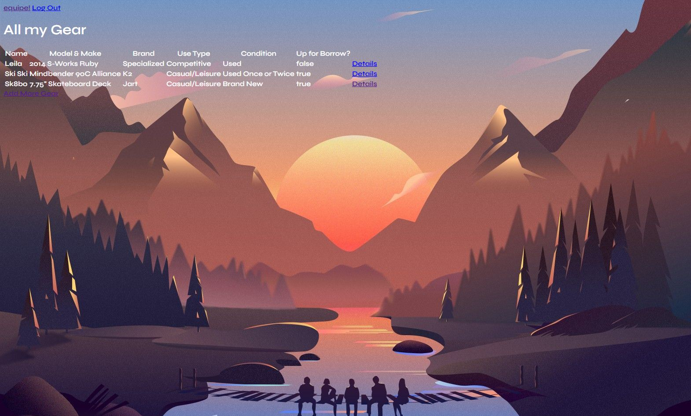

# équipe 

Do you like sports? Do you have a lot of equipment in your gear line up? Wouldn't it be nice if you knew what was in your gear line up, and in your friends? 

Now you can! And then some! 

With équipe, you can keep track of all your gear including it's model, condition, last use, maintenance jobs, and more. You'll also be able to see what other's have in their line up and ask to borrow their stuff! Because sharing is caring 

 ---

### Screenshot 

---

### Technologies Used 

<ul><li>Mongoose - MongoDB, MongoDB Atlas, Node.JS (and EJS), OAUTH, Google Cloud Platform, Heroku, HTML, and barely any CSS </li></ul>

---

### Getting Started 

C'mon click [here!](https://equipe-api.herokuapp.com/)

---

### Planning 

1. [Trello Board (inclusive of User Stories)](https://trello.com/b/Cotj2koq/%C3%A9quipe) 
2. [WireFrames via Figma](https://www.figma.com/file/IpAPHa44Qy2WGV6veZE3bo/SEI-Project-%232---Equipe-App-Wireframes?node-id=1%3A15)
3. [ERD via Diagrams](https://app.diagrams.net/#Hkitkatcode10%2Fequipe%2Fmain%2Fequipe!)

---

### Next Steps 

<ul><li>
I'd like to create another data model to borrow/request to borrow the gear (my train of thought is they are similar to reviews to a movie, and I'd like to share in request, when and what I'm borrowing the gear for)</li>
<li> Add more fields/data points to the gear that are relevant to the user, such as KMs used</li>
<li> Style this thing! Because she's not pretty right now </li>
<li> Send notifications when user has used a certain gear, and remind them to update anything they'd like to track. </li> 
<li> Consume Strava and Garmin's API that lists the Gear the user has shared on their platform, this will automatically populate their equipment (mostly shoes and bikes) and the distance gear has performed. 
Then we can send notifications to the user when the gear has been used a certain amount of times, requires a tune up, or a replacement. </li>
<li> I'd love to make this a gear sharing app, so we can see each other's gear, and request to borrow, whether for free, for a pack of brews, or for an actual lump sum. This would require the implementation of a transaction/check out model (super stretch goal!) </li>

